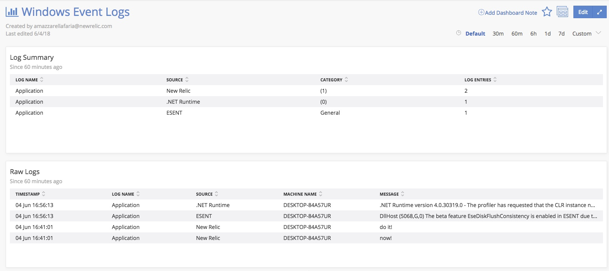

# Windows Event Log Integration

* Pipes Windows PowerShell `Get-EventLog` entries to Insights.
* LogName configurable through Infrastructure definition and config files.

## Disclaimer
New Relic has open-sourced this integration to enable monitoring of this technology. This integration is provided AS-IS WITHOUT WARRANTY OR SUPPORT, although you can report issues and contribute to this integration via GitHub. Support for this integration is available with an [Expert Services subscription](https://newrelic.com/expertservices).

## Instructions

1. Copy .zip from Releases to host
2. Unzip files
3. Copy `infra-windows-config.yml` to `C:\Program Files\New Relic\newrelic-infra\integrations.d`
4. Copy the remaining files to `C:\Program Files\New Relic\newrelic-infra\custom-integrations`
    1. `infra-windows-logs-definition.yml`
    2. `infra-windows-logs.bat`
    3. `infra-windows-logs.ps1`
5. Run: `net stop newrelic-infra`
6. Run: `net start newrelic-infra`

Events are sent to the `Windows Event Logs` Event Type

